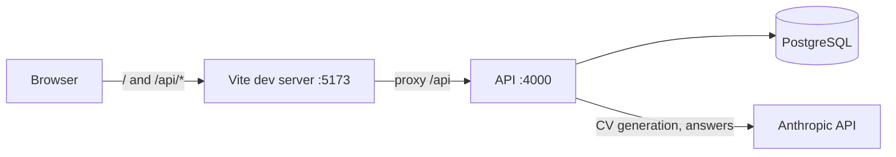

# AI CV Builder

A fullstack app that turns a PDF or a few notes plus a target role into a CV draft written by Claude, which you review, edit and download as an A4 PDF. Built as a take-home assignment.

**Status:** the whole flow works end to end: sign up, create a CV from a PDF and/or notes, follow the generation (a background job that survives reloads), answer the questions the AI asks about what is missing, edit every field, rename or delete CVs, and download the PDF. 612 automated tests, plus 24 on PostgreSQL, cover the API, the shared code and the editor's autosave.

**Stack:** React 19, TypeScript, Vite · Node.js 22, Express 5 (REST), Zod · PostgreSQL 17, Prisma · Anthropic API (Claude Opus 5.5, structured output) · React-PDF · Docker Compose, pnpm, Vitest, GitHub Actions.

**The five things the assignment asks for:** [run the project and the tests](#quick-start) · [architecture and decisions](#architecture-and-main-decisions) · [no invented facts](#how-the-ai-is-kept-from-inventing-facts) · [what I simplified and would do differently](#simplified-for-the-time-limit-and-what-i-would-do-differently) · [how I used AI tools](#how-i-used-ai-tools).
More detail: [docs/architecture.md](docs/architecture.md) · [docs/api.md](docs/api.md) · [docs/development.md](docs/development.md) · [docs/limitations.md](docs/limitations.md).

## Quick start

You need Docker (Docker Desktop, or Docker Engine with Compose v2) and an Anthropic API key that can use `claude-opus-5-5`. Nothing else is installed on your machine.

1. Copy the settings file:

   ```bash
   cp .env.example .env
   ```

2. Open `.env` and put your key after `ANTHROPIC_API_KEY=`. It is the only setting.

3. Start everything:

   ```bash
   docker compose up
   ```

4. Wait for `API listening on port 4000` in the log. The first start builds the image and installs dependencies, which takes a few minutes; later starts take seconds.

5. Open http://localhost:5173, sign up, and press **Create CV**.

If a generation fails right away, `docker compose logs api` names the cause (for example a key without access to the model, or to a beta the request uses). Without a key the app still runs in demo mode: development mocks walk through the real steps and save clearly labelled sample content (the health check, `http://localhost:4000/api/health`, then reports AI as `not_configured`).

- **On a phone:** with the phone on the same network, open `http://<your-computer-ip>:5173` (on macOS, `ipconfig getifaddr en0` prints the address).
- **A port is busy:** `WEB_PORT=5174 docker compose up` (also `API_PORT`, `DB_PORT`).
- **Stop, or start from scratch:** `docker compose down`, or `docker compose down -v` to also delete the data.

More commands and troubleshooting: [docs/development.md](docs/development.md).

## Testing

| What                              | Command                                                                                                             | Needs                       |
| --------------------------------- | ------------------------------------------------------------------------------------------------------------------- | --------------------------- |
| All tests (API, web, shared)      | `pnpm test`                                                                                                         | Node 22 + pnpm on the host  |
| The same, with Docker only        | `docker compose exec -w /app api pnpm test`                                                                         | the running `api` container |
| Data layer on PostgreSQL (opt-in) | `docker compose exec -e TEST_DATABASE_URL=postgresql://cvbuilder:cvbuilder@db:5432/cvbuilder_test api pnpm test:db` | the running stack           |
| Lint, types, formatting           | `pnpm lint && pnpm typecheck && pnpm format:check`                                                                  | Node 22 + pnpm on the host  |

On the host, install Node 22, run `corepack enable`, then `pnpm install` once. `pnpm test` is hermetic (no Docker, database or network, about ten seconds): the route tests start the real Express app with in-memory repositories and fakes for Claude, PDF reading, file storage and PDF rendering, and `src/journey.test.ts` runs the whole flow once, from sign-up to the PDF. The PostgreSQL suite runs the real repositories (row locks, `SKIP LOCKED`, constraints, the delete cascade, user isolation); CI runs it too. What is covered, area by area: [docs/development.md](docs/development.md#tests-in-detail).

## Architecture and main decisions



The browser only calls relative `/api/*` URLs and the dev server proxies them, so requests are same-origin: no CORS, and it works unchanged on a phone.

- **Layers.** Routes validate input with shared Zod schemas and call a service; services hold the business logic and take the acting user's id; repositories own every Prisma query; integrations (Anthropic, file storage, PDF reading and rendering) sit behind small interfaces and are wired by hand in `http/router.ts`, so tests run the app with fakes. Every error has one shape, produced in one place.
- **Accounts and ownership.** Email and password (scrypt), a JWT in an `HttpOnly` cookie. Every query is filtered by the session's user (another user's CV is a `404`), and composite foreign keys `(cv_id, user_id)` make it impossible for a job, document or question to belong to someone else's CV.
- **Generation is a persistent job in PostgreSQL**, not a request. `POST /api/cvs/:id/generations` stores the job and answers `202`; a worker claims it (advisory lock plus `FOR UPDATE SKIP LOCKED`), heartbeats, enforces a deadline and saves the result in the same database. The page polls, so a reload, a closed tab or another device doesn't lose anything; crashed jobs are requeued. Deleting a CV mid-generation stops its job at the next heartbeat.
- **The AI's output is untrusted:** a JSON schema on the way out, strict Zod validation and deterministic checks on the way in ([below](#how-the-ai-is-kept-from-inventing-facts)).
- **Questions and edits.** What is missing becomes a question; an answer is applied by a background job that can change only its own section. Saves are versioned and merged three ways, so a manual edit and an applied answer never overwrite each other (manual edits win).
- **PDF.** React-PDF on the API draws the same view of the CV the preview shows: A4 pages, Geist embedded, real selectable text.

The trade-offs I weighed (Postgres as the queue instead of Redis, React-PDF instead of a headless browser, stateless sessions, whole-document saves, pinned versions) are written up in [docs/architecture.md](docs/architecture.md#decisions-and-trade-offs).

## How the AI is kept from inventing facts

A CV must state only what the person told us. Several layers, from instructions to deterministic checks to the person's own review:

1. **Sources are data, instructions are fixed.** The system prompt forbids inventing employers, titles, dates, degrees, metrics or contact details, and says to report gaps instead of filling them. The PDF text, notes and role arrive in delimited blocks (delimiters neutralised), and the model has no tools.
2. **The schema lets the model leave things out:** every field is required, but an empty string is the documented answer for what the sources don't give, and no field has a format that would push it to produce something plausible.
3. **Output is validated, never trusted:** strict Zod schemas (unknown keys and over-long values rejected), checked again by the worker before saving; ids are assigned by the server.
4. **Contact details and the headline are checked deterministically.** An email, phone or link stays only if it appears in the person's own material (allowing for formatting); what is removed becomes a question. A headline that is only the target role is cleared unless the sources name that title.
5. **Gaps become questions,** worded neutrally so an answer can't turn a leading question into an invented achievement.
6. **Answers are confined:** an answer can change only its own section (and, for a role or school, only that entry); nothing can be deleted; a vague answer gets one follow-up instead of a guess.
7. **The person has the last word:** everything is editable, edits win over an applied answer, and the PDF is drawn only from the saved CV they see.

The limits, honestly: only contact details are checked against the sources mechanically. Employers, titles, dates, numbers and skills rely on the prompt, the schema and the person's review, because a mechanical check for them would also flag correct rewording ("2019–21" for "2019 to 2021"). Text a person can't see in a PDF (white text) is read like any other.

## Simplified for the time limit, and what I would do differently

**Left out** (full list: [docs/limitations.md](docs/limitations.md)): regenerating a CV; more than one template, DOCX uploads, OCR for scanned PDFs; email verification, password reset, revocable sessions and login rate limiting; production Docker and HTTPS; browser end-to-end tests (the web app's pages are checked by hand).

**What I would do differently.** The choice I doubt most is running the job worker, PDF reading and PDF rendering **inside the API process**: it kept the system to three containers with job state transactional with the data, but a crafted PDF or a 95-page CV can occupy the event loop for seconds, and a restart aborts, and bills again, a Claude call in flight. With more time they move to a separate worker (at least `worker_threads`), with the queue unchanged. After that, in order:

1. Revocable sessions and login rate limiting.
2. Server-sent events instead of polling for progress.
3. Production Docker images and HTTPS.
4. A mechanical check that flags (never deletes) a number or year the sources don't contain, tuned on a small set of real CVs.
5. A browser end-to-end test of the main flow, and regenerating a CV.

## How I used AI tools

I built the project with AI coding tools and directed and reviewed the result:

- **Design.** I designed the screens, desktop and mobile with their states (loading, errors, empty, confirmations), on Claude's design canvas first; the web app's markup and CSS follow it.
- **Implementation.** Claude Code (Claude Opus 5.5 and Sonnet 5.5, as the commit trailers say) wrote the code one step at a time. For each step I wrote the requirements; it read the code base and proposed a plan, asking about decisions it couldn't make alone; I corrected or approved the plan; then it implemented it, ran lint, types and tests, and walked through the flow in a browser. I reviewed the changes and the pull requests. Commits carry a `Co-Authored-By: Claude` trailer.
- **Review.** Before submitting I ran a multi-agent review of the whole project (reviewers by area, skeptical verifiers that tried to refute each finding), and a second review that compared the code with the assignment sentence by sentence. Confirmed findings were fixed with tests.
- **What review and testing caught in AI-written code,** each fixed with a test: a U+0000 in pasted text made PostgreSQL reject the write and the API answer `500`; `crypto.randomUUID` doesn't exist on `http://<computer-ip>:5173`, so adding a row did nothing from a phone; the prompt asked for roles "most recent first" although the assignment says most relevant first; the headline could be set to a title the person might not hold; and a delete racing a finishing generation could deadlock in PostgreSQL (the generation locked the job before the CV, every other writer that takes both the other way round).
- **What stayed with me:** the requirements, the product and scope decisions, approving each plan, and reviewing the result.

Claude is also part of the product: the API calls the Claude API to write CVs and apply answers. That is separate from the tools used to build it.
