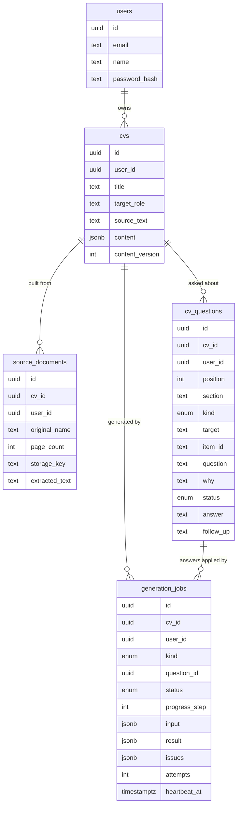
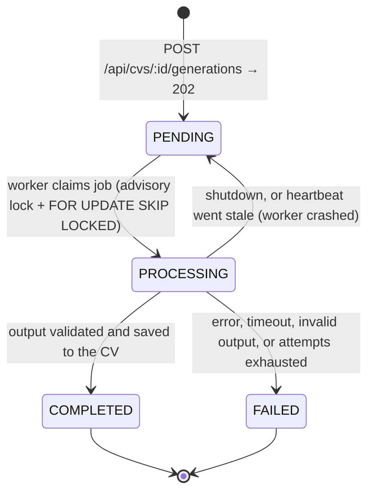

# Architecture

How the system is built and why. The [README](../README.md) has the short version, the reasoning behind the main trade-offs and how invented facts are prevented; the REST endpoints, authentication and error codes are in [api.md](api.md), the commands, configuration and tests in [development.md](development.md).

## Backend layers

Each concern has its own place, so it can be reviewed and replaced on its own:

- **HTTP** (`http/`, `modules/*/*.routes.ts`): Express wiring. Route handlers validate input with the shared Zod schemas, call a service, and map results to DTOs. They contain no business logic.
- **Business logic** (`modules/*/*.service.ts`): framework-agnostic. Services take the acting user's id plus validated input.
- **Data access** (`modules/*/*.repository.ts`, `db/`): every Prisma query lives here. Every query made for a request is scoped to the session's user; the background worker acts only on jobs it has claimed. Mappers make sure database rows never leak to HTTP.
- **Integrations**: `integrations/ai` (Anthropic), `integrations/storage` (uploaded files), `integrations/extraction` (PDF to text with unpdf) and `integrations/pdf` (CV to PDF). Each sits behind a small interface used by the services.

Dependencies are wired by hand in `http/router.ts` (repositories, then services, then routers); there is no DI container. `createApp()` takes all of its dependencies as arguments, so tests run it with fakes on a random port.

## Data model

- **CV content** is a structured JSON document stored on the CV, because it is always read and written together with its CV. Every list entry (role, bullet, school, skill, link) has a stable id. It is validated against a shared Zod schema before every write. `content_version` provides optimistic locking (see [Editing and the AI's questions](#editing-and-the-ais-questions)).
- **Questions** are the AI's questions about a CV, one row each, so each has its own status (`OPEN`, `SKIPPED`, `ANSWERED`, `DISMISSED`), latest answer and follow-up.
- **Generation jobs** keep a validated snapshot of their `input`, plus their validated `result` and `issues`, which allows auditing and restoring. Replacing or removing a PDF never changes a job's snapshot.
- **Source documents** store file metadata and the extracted text. The uploaded PDF is kept on local disk (`UPLOAD_DIR`, the `uploads` volume) under a key the API generates, and deleted when it is replaced or removed; generation only uses the extracted text.
- A CV is named after its target role until it is renamed (`PATCH` with a `title`); a role saved later renames it again only while it still has that automatic name.
- **Deleting a CV** removes its jobs, questions and documents with it (the foreign keys cascade), in one transaction that locks the CV's row first (as does every writer of a CV and its jobs, so a delete and a generation finishing at the same moment can't wait on each other: a test checks it on PostgreSQL). The stored PDF is deleted once the transaction has committed; if that fails it is only logged, as the rows are already gone. A generation running at that moment finds its job gone at the next heartbeat and stops, and its Claude request is aborted.
- IDs are UUIDv7 (time-ordered) and all timestamps are `timestamptz`.

## CV generation as a persistent job

Generation runs without a queue service, inside the API process:

1. The API stores the job and immediately responds `202 Accepted`. Nothing depends on the browser request staying open: the person can close the tab, reload, or come back later.
2. A worker inside the API process claims pending jobs from PostgreSQL and updates `heartbeat_at` while it runs. A claim is one short transaction under an advisory lock (so two answers to one CV never run at once) with `SELECT … FOR UPDATE SKIP LOCKED`; the job itself runs outside the lock. It runs up to three jobs at a time, so one user's minute-long generation doesn't hold up everyone else's. If the process dies, jobs with a stale heartbeat (30 s) are re-queued, or failed with `WORKER_LOST` after three attempts.
3. Every job has a deadline (4 minutes for a generation, 2 minutes to apply an answer; constants in `generation.worker.ts`) that covers the generator's own retries. The worker enforces it: the generator's abort signal fires, a generator that doesn't stop is abandoned anyway, and the job fails with `AI_TIMEOUT`.
4. The client polls `GET /api/generation-jobs/:id`, or leaves and checks later. The database is the source of truth for job state. On shutdown (including `tsx watch` restarts) the worker hands its jobs back to the queue without counting the attempt; every write a worker makes is fenced by the job's attempt number, so a job taken over after going stale can't be overwritten by the old run. A brief database error while a job runs doesn't fail it. A restart aborts an in-flight Claude request, and the job runs again from the start (and is billed again).
5. LLM output is never trusted. It is validated with strict Zod schemas before anything is saved, and the raw output is never stored or logged.

### Generation with Claude

`modules/generation/claude/` implements the generator on top of the Anthropic client in `integrations/ai/claude-client.ts`. Without an API key (development only), `mock-cv-generator.ts` stands in.

- **Model:** `claude-opus-5-5` (`CLAUDE_MODEL`), streamed, with adaptive thinking and effort `medium`. Both are constants in `claude-client.ts`; raise the effort to `high` if the quality falls short (slower and more expensive). The request uses what Opus 5.5 offers, so another model may reject it.
- **Server-side refusal fallback:** if the model's safety classifiers decline a request (a CV in security or biology can trip them), the Anthropic API hands it over to a fallback model it picks instead of refusing.
- **Prompt:** the system prompt holds only the instructions (see [Preventing invented facts](../README.md#preventing-invented-facts)). The user's PDF text and notes and the target role follow in separate delimited blocks, and the prompt treats their content as data, not instructions.
- **Order:** the roles come ordered by relevance to the target role (the most recent first among equally relevant ones), and so do each role's achievements and the skills; education is most recent first. The person can reorder roles and education by hand.
- **Structured output:** Claude answers in JSON constrained by a schema. The API checks the stop reason, parses the JSON and validates it with a strict Zod schema, then maps it to the shared CV content schema, which the worker checks once more before saving. Invalid JSON, a schema mismatch or a stream that broke off midway gets one retry within the same deadline. Lists that run over their limits lose their tail (roles, bullets and skills come most relevant first, education most recent first); a skill or a question that breaks its limits is dropped rather than failing the CV, while a fact field (a title, a company, an achievement) that breaks its limit fails the answer, as cutting a fact short would change it.
- **Issues:** what the AI found missing, ambiguous or incomplete (a role without dates, no email), phrased as questions for the user. When an issue is about one role or school, Claude names it, and the API records that entry's id. The issues stay on the job (`issues` in `GET /api/generation-jobs/:id`) and become the CV's questions.

## Editing and the AI's questions

A generated CV opens in the editor. If the AI asked questions, the "ready" screen offers them first ("A few quick questions"); skipped and open questions also wait at the top of the editor.

**Saving.** The editor saves automatically, 700 ms after the last edit, one request at a time. Each save sends the whole document with the version it was edited from (`PUT /api/cvs/:id/content`). The editing state lives outside React (`features/editor/editor-session.ts`), so a save in flight finishes and edits made just before leaving still go out: edits are saved at once when the page goes to the background (a phone switching apps), before logging out (which asks first if some can't be saved), and again when the connection comes back after a failed save; closing the tab with unsaved edits asks first. A value that breaks a rule (an incomplete email) shows its error under the field and stays unsaved, while everything else is saved. The rules apply only to what changed, so a value that was already stored never blocks a save.

**Edits are never overwritten.** Every write of the content (a save, an applied answer) bumps `content_version` under a lock on the CV's row; a save over an older version gets `409 CONTENT_CONFLICT` with the newer content. Both sides then use one three-way merge (`packages/shared/src/cv-merge.ts`): from the version both copies started at, a field only one side changed takes that change, and a field both changed keeps the person's edit. Lists merge entry by entry, by id, so an AI addition and a manual edit to another entry both survive, and a deleted entry stays deleted. The editor merges every newer version it receives (an applied answer, another tab) into its unsaved draft the same way.

**Answering a question.** An answer is saved with the question and queued as an `APPLY_ANSWER` job (the same queue and worker as generations; answers are claimed first, since they take seconds). Answers to one CV run one at a time, each from the CV as it is when the job starts, so each builds on the one before.

1. Claude gets the CV, the question (its section and, for a role or school, which one) and the answer, and replies in a schema that covers only that section (see [Preventing invented facts](../README.md#preventing-invented-facts) for what an answer may change).
2. Contact details must appear in the answer itself, as in generation; an invented or incomplete one turns into a follow-up question instead. Details the CV already has, repeated in another form, don't count as new.
3. If the answer is too vague to state as a fact, Claude asks one follow-up question instead of guessing; the question opens again with it. It never asks twice.
4. The changes are merged into the CV as it is now (see above), so whatever the person edited while the job ran is kept. Additions that duplicate an entry or don't fit a list's limit are left out. The result is validated again before it is written, and the job records what changed (`updated`, `no_change` or `needs_more_info`).

The editor and the questions screen follow running updates by polling the job, and show "Updating…", the outcome, or a failure with "Try again". A failed update changes nothing.

## PDF export

"Preview & download" in the editor opens the preview page (`/cvs/:id/preview`): the CV at full size, as its PDF will look, and the download. The API renders the PDF from the CV as saved (`GET /api/cvs/:id/pdf`). The page first saves any edits still waiting in the editor, so the PDF has the latest version; edits that can't be saved (a failed save, a value with an error) are left out, and the page says so.

- **Rendering:** React-PDF (`integrations/pdf`) draws the design's CV template on A4 pages, from the same view of the content as the on-screen preview (`packages/shared/src/cv-view.ts`), so both agree on what is printed. The text is real text with Geist embedded (Regular, Medium, SemiBold and Bold; Latin and Cyrillic; SIL Open Font License, in `integrations/pdf/fonts`), so it can be selected and applicant tracking systems can read it. The email and web addresses are links. Section headings are tracked a little less than in the design (.08em, not .14em): PDF text extractors read wider gaps as spaces and would see "E X P E R I E N C E".
- **Pages:** the template's blocks sit directly on the page, which is how React-PDF can keep them together. A section heading never ends a page; a role's title, company and first achievement stay together, and every further achievement moves to the next page whole. Paragraphs (the summary, a degree's details) flow on to the next page, never leaving one line behind. The content limits keep every unbreakable block shorter than a page, so nothing runs into the margins: a test renders the largest CV the limits allow and checks it.
- **Speed:** rendering runs in the API process. A typical CV takes 30–50 ms (the first after the API starts about half a second, as the fonts load and the glyph caches are primed, see below). The largest CV the limits allow, 95 pages, takes about 3 s on an M1 Pro and 4–5 s in the Docker VM, during which the API answers nothing else. A worker thread is the next step if exports become frequent.
- **Text layer:** React-PDF keeps one set of fontkit glyph caches for the life of the process, and fontkit caches a glyph with the code points of whoever asks first. The first CV with an accented letter (ü, ž, Ş) used to cache its base letter with no code point, so later PDFs lost the text mapping of that letter (copying or an applicant-tracking parser read "Slovenia" as "'lovenia"). Before the first PDF is drawn the renderer now asks for every letter of the fonts (Latin, Cyrillic) once, and a test renders accented letters first and checks the PDFs that follow. Ligature glyphs (fi, fl) are deliberately not asked for: the layout must cache them itself with all of their code points, or it counts a character too few after every "fi" and lines break in the middle of words; a second test wraps a paragraph full of ligatures and checks that no word is cut. The view both the preview and the PDF draw (`cv-view.ts`) also composes accents (NFC), turns spaces of other widths into an ordinary one, drops invisible direction marks and maps the hyphens Geist lacks (U+2010, U+2011) to a plain one.
- **Limits:** characters Geist doesn't have (emoji, Greek, Chinese, Arabic and so on) come out as wrong symbols or gaps: there is no fallback font. A word of 60 characters or more (in practice a URL) can break across lines, and React-PDF prints a hyphen at the break.
- **File names:** the response calls the file `CV.pdf`: response headers are logged, and a person's name doesn't belong in logs. The page names the download after the person (`Alex_Morgan_CV.pdf`), and the name can be changed there.
